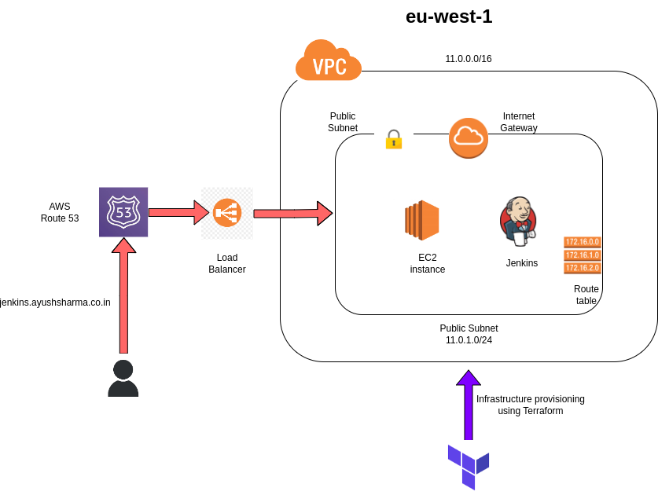
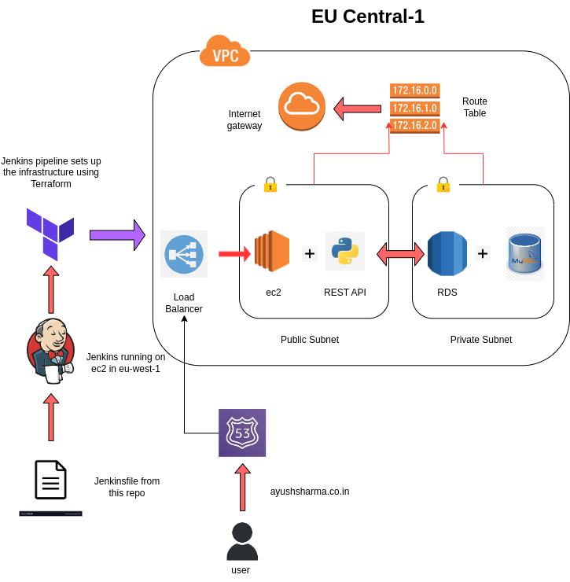

# DevOps Integration with Terraform, Jenkins, and AWS

This project consists of 3 directories:

## 1) jenkins-on-ec2:

This directory contains Terraform code to set up infrastructure on AWS as shown in the figure below. The main idea is to create an EC2 instance in a public subnet and install a Jenkins server on it. Security groups, route tables, load balancer, and certificate manager are also configured.

## 2) flask-app-aws:

This directory contains code to set up infrastructure on AWS as shown in the figure below. The Jenkinsfile (which contains code to set up infrastructure) present in this directory is used by the Jenkins server running on the EC2 instance in the eu-west-1 region defined in the directory `jenkins-on-ec2`.

## 3) simple-flask-app:

This directory contains code to create a simple Python Flask application.

## Overview of the Project:

This DevOps project demonstrates the implementation of a continuous integration and continuous deployment (CI/CD) pipeline using Terraform, Jenkins, and AWS Cloud. The project is divided into three main categories: tools, application, and AWS components.

Under the tools category, Terraform is used for infrastructure automation, while Jenkins is employed for CI/CD pipelines. In the application category, a REST-based web application is built using Python Flask, with data stored in a MySQL database hosted on an RDS instance within AWS. AWS components such as custom domains, EC2 instances, and RDS instances are utilized to support the project infrastructure.

The project covers various aspects of DevOps practices, including setting up a VPC and subnets, provisioning EC2 instances and Jenkins installation, configuring load balancers for efficient traffic distribution, managing DNS with Route 53, obtaining and managing SSL certificates, and creating Jenkins pipelines for infrastructure provisioning and application deployment.

Overall, this project showcases the integration of popular DevOps tools to automate the deployment process, improve code quality, and streamline development workflows for efficient software delivery.
